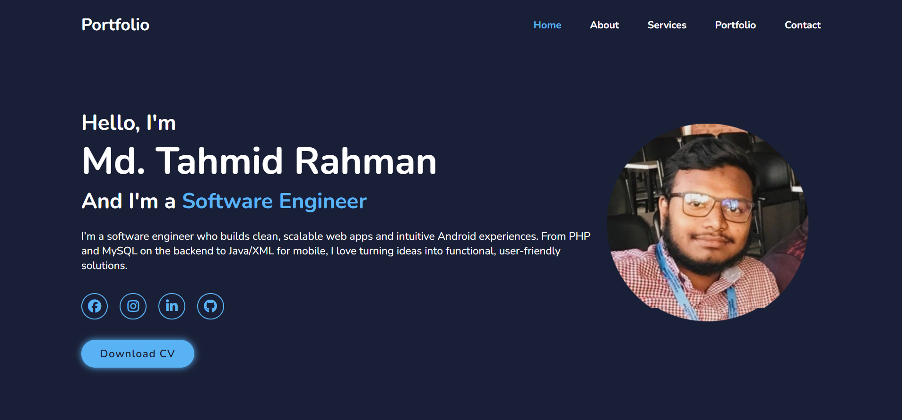
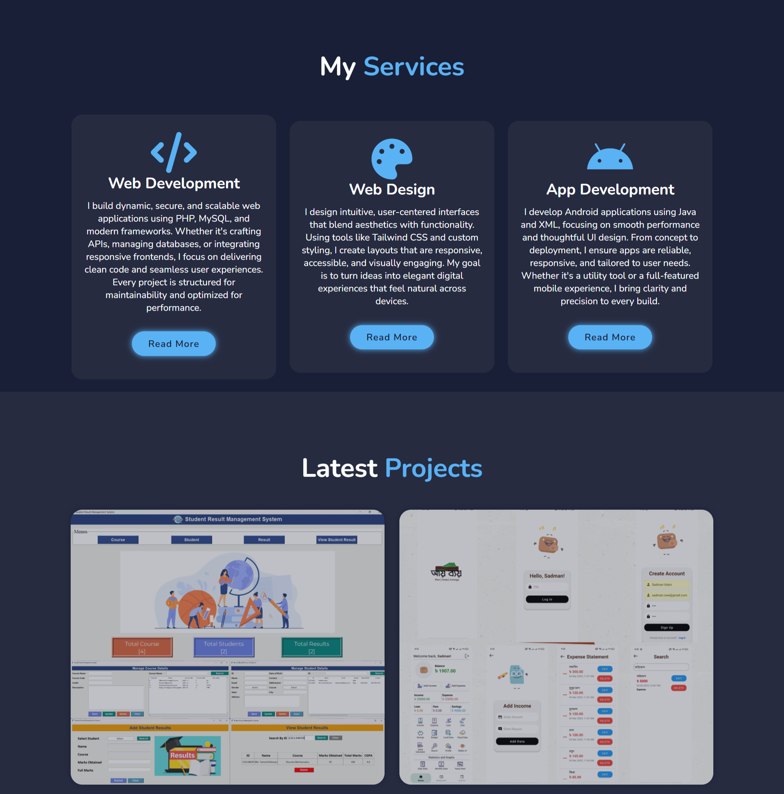
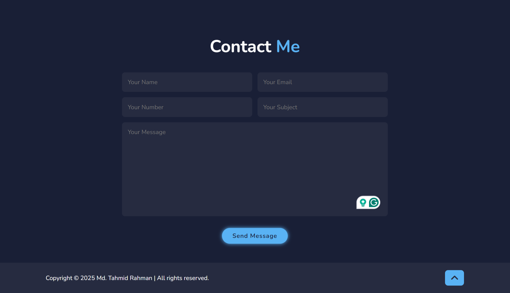

# Md. Tahmid Rahman — Developer Portfolio

A modern, clean dark-themed UI with soft blue accents for my personal portfolio, built using HTML, CSS, and Font Awesome. It showcases my expertise in web development, UI design, and Android app development, featuring a selection of my projects and providing easy contact options.

---

## Features

- Dark-themed neon UI with animated effects
- Fully responsive layout for all screen sizes
- Sections: Home, About, Services, Portfolio, Contact
- Social media integration (Facebook, Instagram, LinkedIn, GitHub)
- Portfolio cards with hover overlays and external project links
- Contact form with styled inputs

---

## Technologies Used

| Language | Styling | Icons |
|----------|---------|-------|
| HTML5    | CSS3    | Font Awesome |
| Responsive Grid & Flexbox | Clean Dark UI with Soft Blue Accents | CDN-based Icons |

---

## Folder Structure

```
portfolio/
├── index.html         # Main HTML file
├── styles.css         # Custom CSS styling
├── images/            # Profile and project images
└── README.md          # Project documentation
```

---

## Setup Instructions

1. **Clone the repository**
   ```bash
   git clone https://github.com/mdtahmidrahman/just-another-portfolio.git
   ```

2. **Open the project**
   - Navigate to the folder and open `index.html` in your browser

3. **Customize**
   - Replace images in `/images`
   - Update social links and project URLs in `index.html`

---

## Screenshots

| Homepage | Portfolio Section | Contact Form |
|----------|-------------------|--------------|
|  |  |  |

---

## Live Demo

Experience the portfolio live:

- [Visit Live Site](https://mdtahmidrahman.github.io/just-another-portfolio/)  
*(Hosted via GitHub Pages — fast and free)*

---

## 📬 Contact

Feel free to reach out via:
- Email: [mdtahmidr@gmail.com]
- [LinkedIn](https://www.linkedin.com/in/md-tahmid-rahman/)
- [GitHub](https://github.com/mdtahmidrahman)

---

